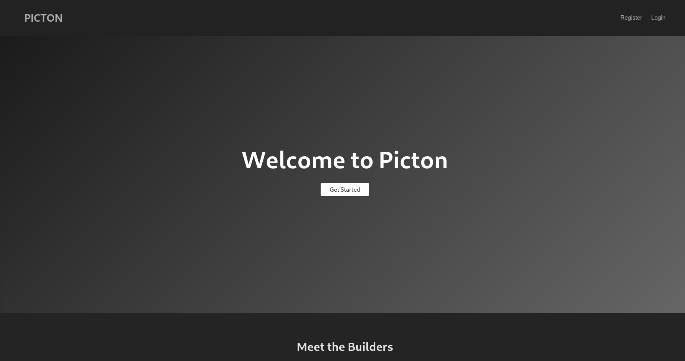
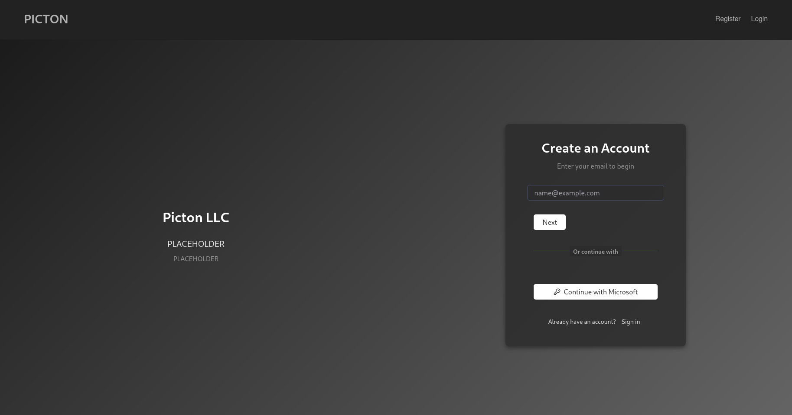
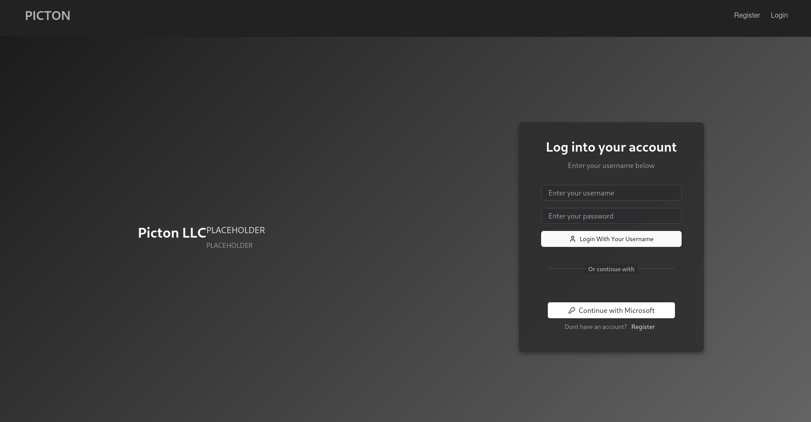
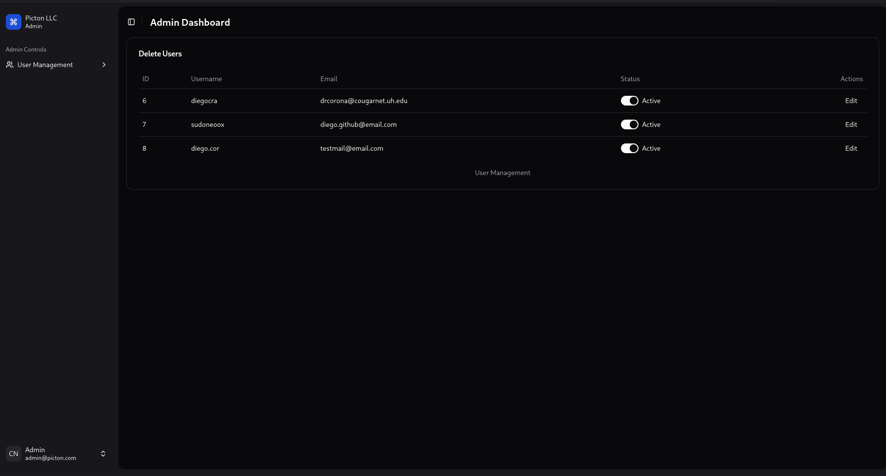

# User Management Module – Picton Project

## Overview

The User Management module is a core component of the Picton project. It provides a secure and robust system for managing user accounts and supports both traditional email/password authentication and Office365 (Azure AD) authentication. The module also implements Role-Based Access Control (RBAC) and user deactivation/reactivation features.

## Functional Requirements
- Homepage

- **Authentication:**  
  - Users can sign in using their Office365 credentials.  
  - Traditional email/username and password authentication is also supported.

Registration Page

Login Page

- **User Management:**  
  - Administrators can perform CRUD operations on user accounts.  
  - User attributes include name, email, role, status, phone number, and more.  
  - The default role for new users is a boolean state that checks whether they're an admin or not.

Admin Dashboard

- **Role-Based Access Control (RBAC):**  
  - The system supports two user roles with different access levels.  
  - Administrators can assign and modify user roles to control feature access and permissions.

- **User Deactivation:**  
  - Administrators can deactivate or reactivate user accounts.  
  - Deactivated users are prevented from logging in or accessing system resources.

## Technical Implementation

### Backend

- **Framework & Model:**  
  - Developed using Django with a custom User model that extends `AbstractBaseUser` and `PermissionsMixin` to include additional fields (e.g., role).  
  - A custom manager (`CustomUserManager`) is used to handle user creation, ensuring the default role is set to "basicuser".

- **API Endpoints:**  
  - **Registration & Login:**  
    - Endpoints for traditional registration (`/api/register/`) and login (`/api/login/`) using email/username and password.  
    - Endpoints for Azure AD registration (`/api/azure/register/`) and login (`/api/azure/login/`).
  - **User CRUD & RBAC:**  
    - A DRF `UserViewSet` is used for admin-level CRUD operations on user accounts.  
    - Custom actions (e.g., `toggle_status` or `set_status` and `set_role`) enable administrators to manage user activation and roles.

- **Error Handling & Logging:**  
  - API endpoints leverage Django REST Framework exceptions (e.g., `ValidationError`, `AuthenticationFailed`, and `APIException`) for standardized error responses.  
  - Debug logging is used during development to help trace issues.

### Database

- **Database Engine:**  
  - PostgreSQL is used as the primary database to store user data and other project-related information.
- **Migrations:**  
  - Django’s migration framework manages database schema changes, ensuring consistency between development and production.

### Frontend Integration

- The React-based frontend communicates with the backend API endpoints for user authentication and management.
- API endpoints are configured (via environment variables) to point to the local backend server (e.g., `http://localhost:8000/api`).

## Testing and Deployment

- **Local Testing:**  
  - The backend API is tested using API clients like Postman and integrated with the React frontend.
  - You can also use Django’s `dbshell` to inspect the database directly.
- **Collaboration:**  
  - All development is tracked via GitHub. A collaboration report is available at [GitHub Contributors Graph](https://github.com/sudoneoox/Picton/graphs/contributors).

## Future Enhancements

- Integration of additional authentication providers (e.g., Google).  
- Expanded RBAC with more granular permission management.  
- Self-service endpoints for profile updates and password management.  
- Enhanced logging and error handling for production readiness.  
- Comprehensive unit and integration testing for the User Management module.

---
